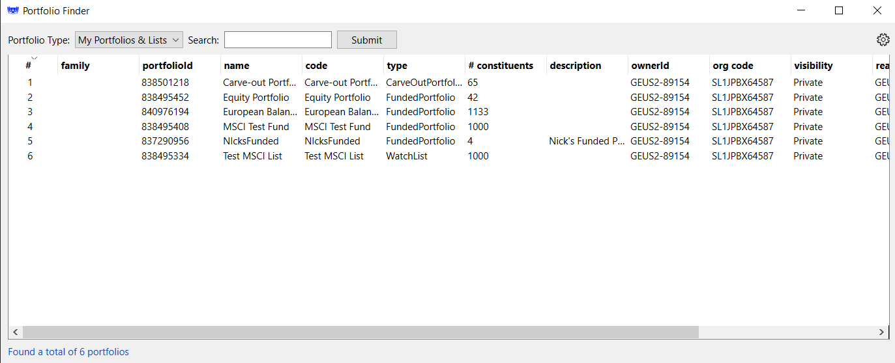
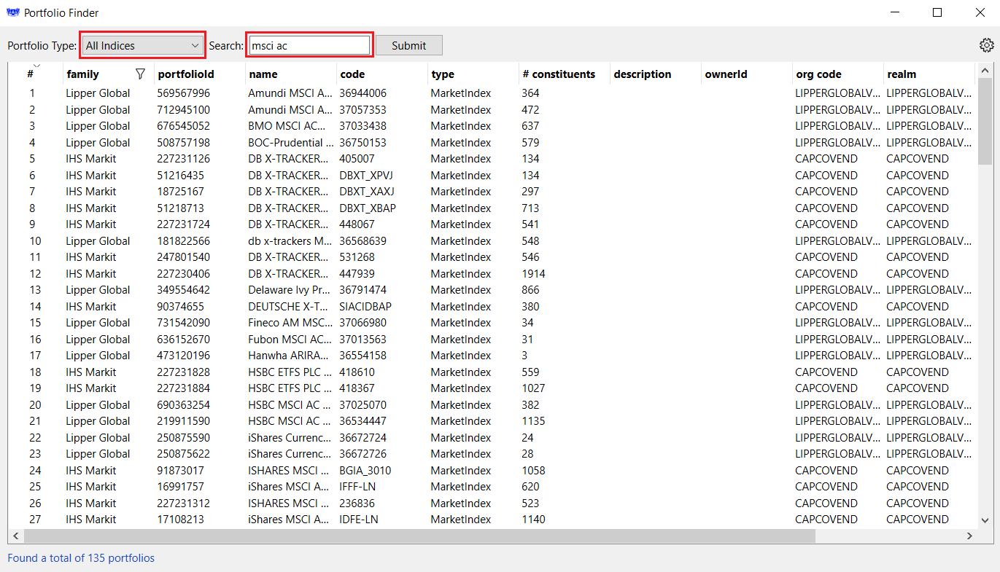

# PortfolioFinder
The PortfolioFinder utility is a simple, convenience tool allowing users of the PAM (Portfolio Analytics and Management) API the selection of a specific <em>ID</em> required for purpose of analyzing portfolios.  Experienced users of LSEG portfolios are quite familiar with the Workspace Apps: PAL (Portfolio and Lists Manager) and PORTF Portfolio Analytics. These Apps are tightly integrated allowing users to easily select the portfolios they wish to analyze. However, when working within PAM, users will be required to reference their specific portfolios of interest using a <em>Portfolio ID</em>.  Built using PAM APIs, the PortfolioFinder is a GUI-based tool providing a simple interface allowing selection and filtering to display portfolios and the associated IDs of interest.

## Utility download

A pre-built executable and Readme is available for Download within the [LSEG Developer Platform](https://developers.lseg.com/en/tools-catalog/portfolio-finder).

## Running the Utility

The <b>PorfolioFinder</b> utility provides the ability to connect directly to LSEG's Delivery Platform, via LSEG's [Data Platform for Python](https://developers.lseg.com/en/api-catalog/refinitiv-data-platform/refinitiv-data-library-for-python) library accessing the Portfolio service via the [Portfolio Analytics & Management APIs](https://apidocs.refinitiv.com/Apps/ApiDocs#/details/L3VzZXItZGF0YS9wb3J0Zm9saW8tbWFuYWdlbWVudC92MQ==/L3BvcnRmb2xpb3M=/GET/README).

Prior to running, ensure you have setup access credentials to the Delivery Platform providing the necessary data services.

For convenience, the package includes a configuration file (<em>refinitiv-data.config.json</em>) providing the ability to specify credentials required to connect into the Delivery Platform accessing portfolio services.  However, if users have an existing Python environment and configuration settings in place, they can optionally set the enviroment variable: <em>RD_LIB_CONFIG_PATH</em>.  Alternatively, this package does include a configuration file for users to specify their platform credentials:

```json
{
  "http": {        
     "request-timeout": 120
  },
  "logs": {
    "level": "debug",
    "transports": {
      "console": {
        "enabled": false
      },
      "file": {
        "enabled": false,
        "name": "/tmp/refinitiv-data-lib.log"
      }
    }
  },
  "sessions": {
    "default": "platform.dp",
    "platform": {
        "dp": {
            "app-key": "<appkey>",            
            "username": "<username>",
            "password": "<passwd>",
            "signon_control": true
        }
    }
  }
}
```

## Usage

Upon launch, the tool will go through the connection and validation to the Delivery Platform then load up user-defined portfolios.  For example:



Within the interface, you can select index-based portfolios by choosing the <em>Portfolio Type</em> and optionally filter out based on either the 'name' or 'code' using a filter expression.  For example:



## Author

| **Name** | **Release** | **Details** |
| --- | --- | --- |
| Nick Zincone | Release 1.1.0 | Upgraded to use Qt library<br>Support for column sorting and filtering |
| Nick Zincone | Release 1.0.0 | Initial implementation |

